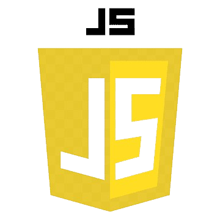

# Verde Visionaries
 

## 📋 Description:
**Verde Visionaries is a small team of people with similar ideas and an aspiration for ecology. Our initiative is to encourage people to be more responsible and provide a website for those who share our interests. Are you ready to go green?**

## 🖥 Team Members:
* **Kaloyan Ivanov** - *Developer* 
* **Kristian Dimitrov** - *Developer* 
* **Ivan-Mihail Ivanov** - *Scrum-trainer* 
* **Ivaylo Gyurov** - *Designer* 
* **Alexander Manov** - *Mentor*

## Languages and tools:

  
     
     
    
    
    
    

